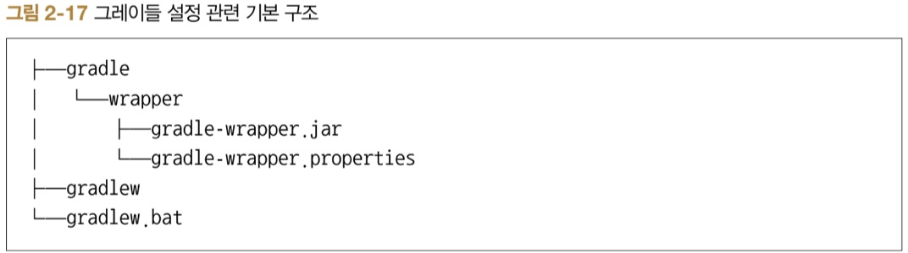

# ch2. 스프링 부트 환경 설정

## 2.1
## 2.2
## 2.3 그레이들 설치 및 빌드하기

### 2.3.1 그레이들 래퍼

* gradlew : 리눅스 및 맥OS용 셸 스크립트
* gradlew.bat : 윈도우용 배치 스크립트
* gradle/wrapper/gradle-wrapper.jar : Wrapper JAR
* gradle/wrapper/gradle-wrapper.properties : 그레이들 설정 정보 프로퍼티 파일(버전 정보 등)

그레이들 4.8.1 버전으로 올리고 싶다면 다음 명령을 실행  
```$ ./gradlew wrapper --gradle-version 4.8.1```

그레이들 버전학인  
```$ ./gradlew -v```

### 2.3.2 그레이들 멀티 프로젝트 구성하기

1. setting.gradle 설정  
```rootProject.name = 'community'```
1. communiy-web 모듈 생성
1. Add as module to에서 community 프로젝트 선택
1. community-web 생성된 기본 패키지 확인
1. community-domain 모듈 생성

## 2.4 환경 프로퍼티 파일 설정하기

> src/main/resources/application.properties 파일을 통한 설정 변경

기본 8080포트를 80번으로 변경 시  
```server.port: 80```

> src/main/resources/application.yml 파일을 통한 설정 변경
```
server:
    port: 80
```
### 2.4.1 프로파일에 따른 환경 구성 분리
> src/main/resources/application.yml에서 프로파일별 설정 구분
```
server:
    port: 80
---
spring:
    profiles: local
server:
    port:8080
---
spring:
    profiles: dev
server:
    port:8081
---
spring:
    profiles: real
server:
    port: 8082
```

> application-{profile}.yml

> 프로파일값을 적용하여 애플리케이션 실행  

```java -jar ... -D spring.profiles.active=dev```

### 2.4.2 YAML 파일 매핑하기

@Value

