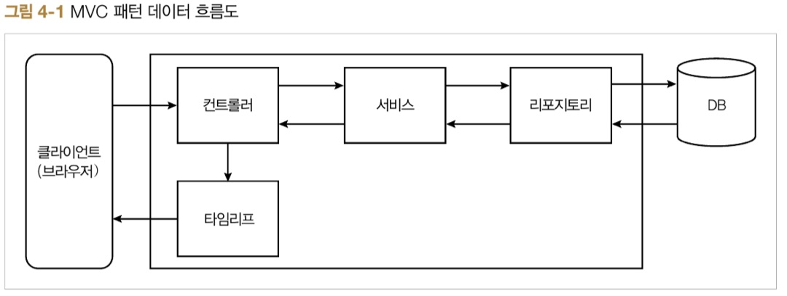
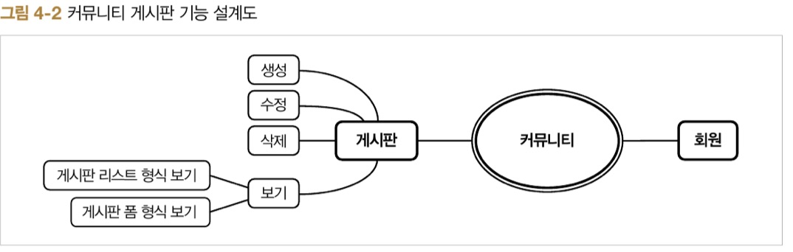
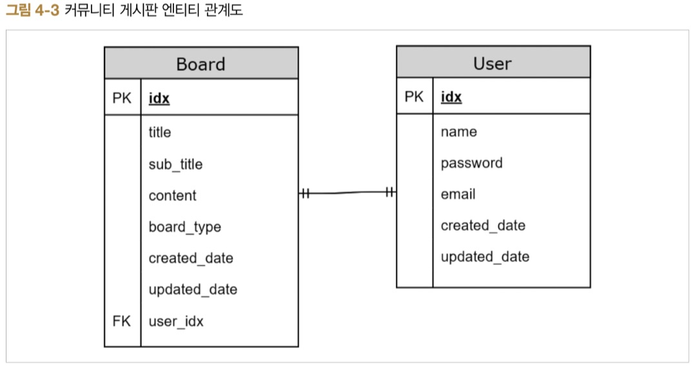
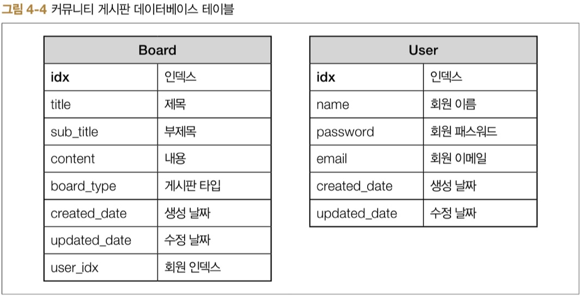
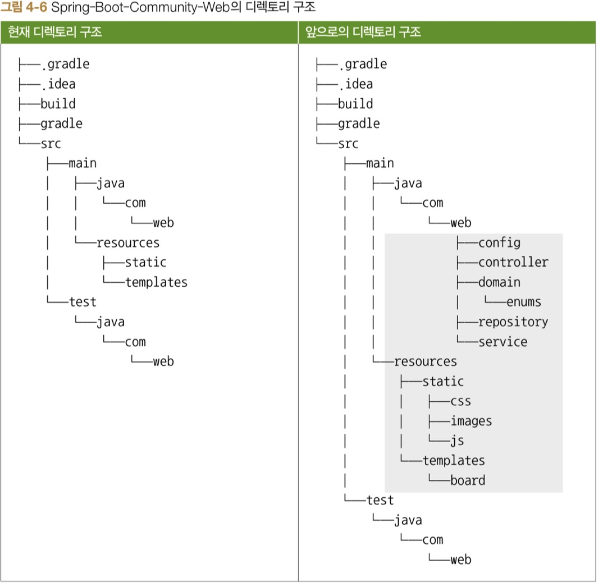
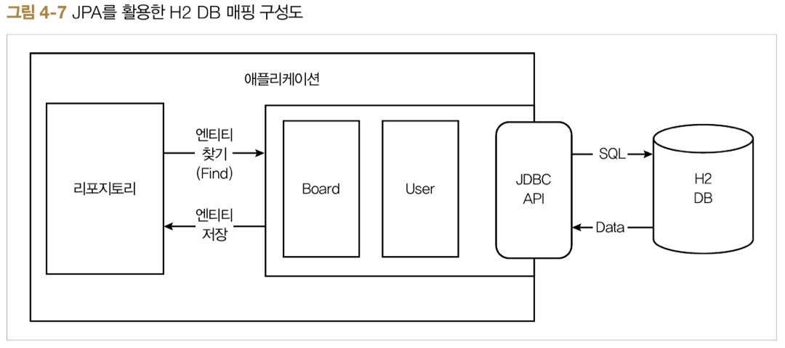

# ch4. 스프링 부트 웹

## 4.1 커뮤니티 게시판 설계하기









## 4.2 커뮤니티 게시판 프로젝트 준비하기

## 4.3 커뮤니티 게시판 구현하기

1. 프로젝트 의존성 구성
1. 스프링 부트 웹 스타터 살펴보기
1. 도메인 매핑하기
1. 도메인 테스트 하기
1. CommandLineRunner를 사용하여 DB에 데이터 넣기
1. 게시글 리스트 기능 만들기
1. 타임리프 자바8 날짜 포맷 라이브러리 추가하기
1. 페이징 처리하기
1. 작성 폼 만들기

### 4.3.1 프로젝트 의존성 구성


### 4.3.2 스프링 부트 웹 스타터 살펴보기

### 4.3.3 도메인 매핑하기
> 도메인 매핑은 JPA를 사용하여 DB와 도메인 클래스를 연결시켜주는 작업



### 4.3.4 도메인 테스트하기

> @DataJpaTest는 JPA에 대한 테스트를 지원하는 어노테이션

### 4.3.5 CommandLineRunner를 사용하여 DB에 데이터 넣기

### 4.3.6 게시글 리스트 기능 만들기

### 4.3.7 타임리프 자바 8 날짜 포맷 라이브러리 추가하기

> temporals의 format 함수를 사용하여 날짜 포맷 변환을 수행  
> temporals를 사용할 수 있게 해주는 thymeleaf-extras-java8time 의존성은 spring-boot-start-thymeleaf 스타터에 포함되어 있다.

```
${#temporals.format(temporal, 'yyyy/MM/dd HH:mm')}
${#temporals.arrayFormat(temporalsArray, 'yyyy/MM/dd HH:mm')}
${#temporals.listFormat(temporalsList, 'yyyy/MM/dd HH:mm')}
${#temporals.setFormat(temporalsSet, 'yyyy/MM/dd HH:mm')}
```

### 4.3.8 페이징 처리하기

### 4.3.9 작성 폼 만들기


