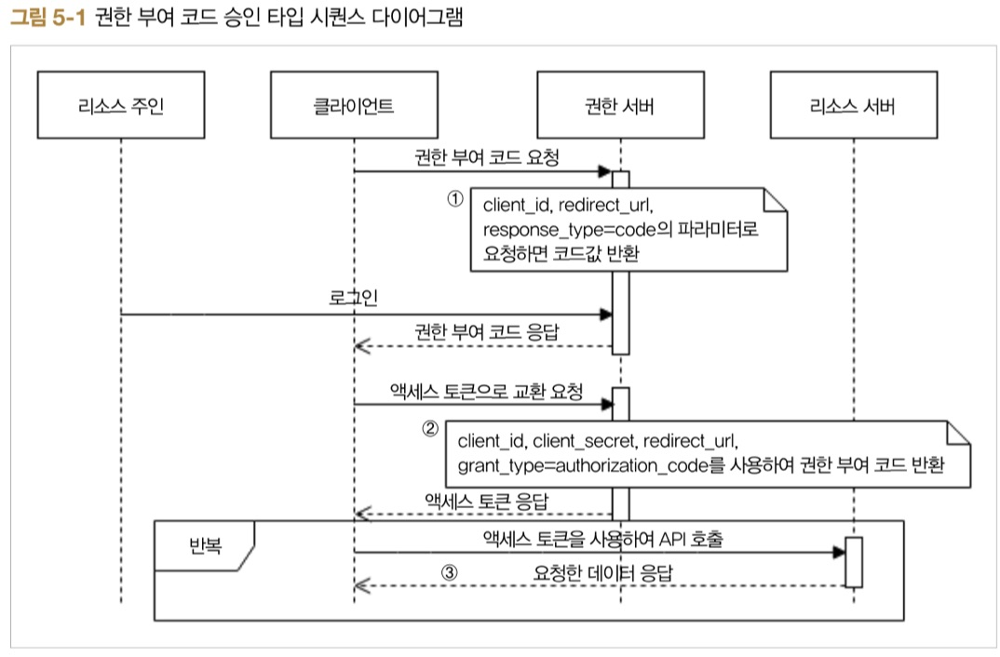
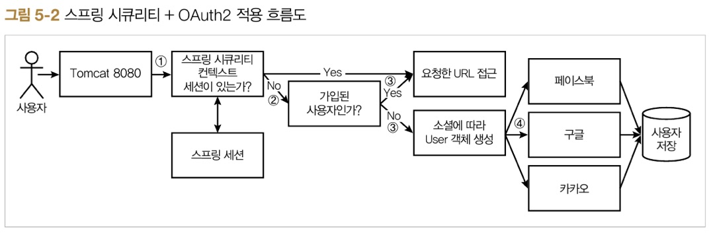
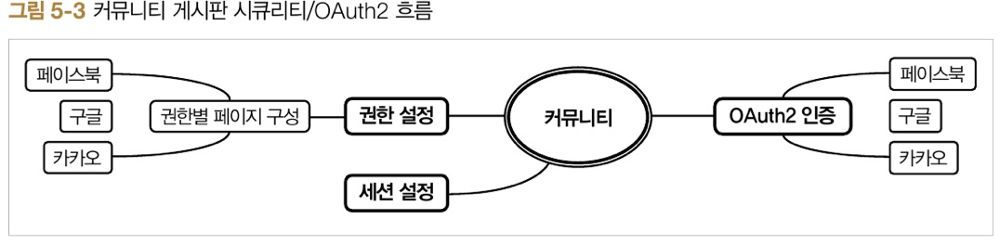
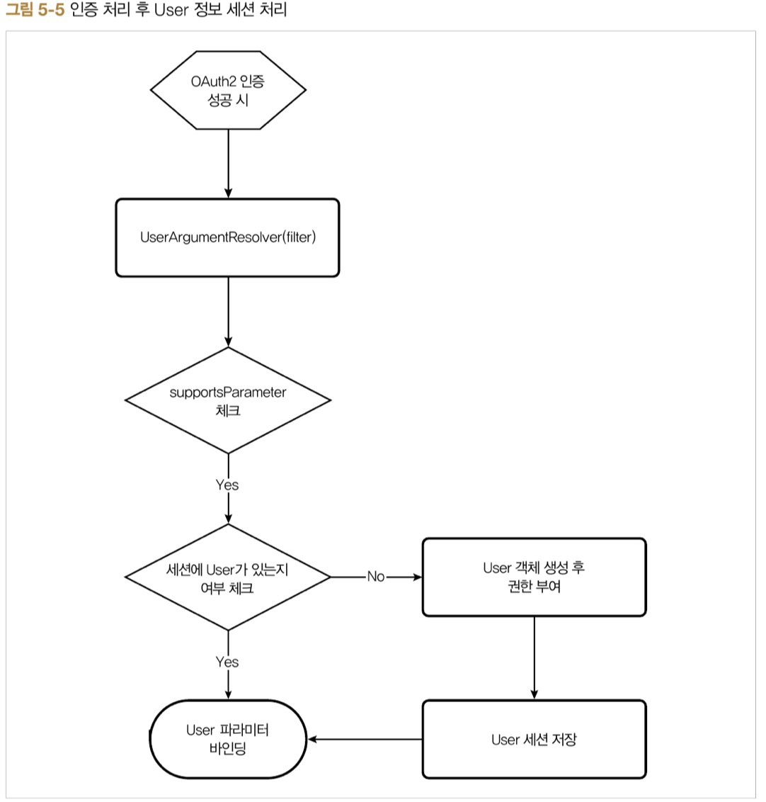

# ch5. 스프링 부트 시큐리티 + OAuth2

## 5.1 배경지식 소개

### 5.1.1 스프링 부트 시큐리티
>인증은 사용자(클라이언트)가 애플리케이션의 특정 동작에 관하여 허락(인증)된 사용자인지 확인하는 절차  
> 권한부여는 데이터나 프로그램 등의 특정 자원이나 서비스에 접근할 수 있는 권한

### 5.1.2 OAuth2
> OAuth는 토큰을 사용한 범용적인 방법의 인증을 제공하는 표준 인증 프로토콜  
> OAuth2는 OAuth 프로토콜이ㅡ 버전 2이며, 서드파티를 위한 범용적인 인증 표준

> OAuth2에서 제공하는 승인 타입
* 권한 부여 코드 승인 타입 : 클라이언트가 다른 사용자 대신 특정 리소스에 접근을 요청할 때 사용됩닏. 
* 암시적 승인 타입
* 리소스 소유자 암호 자격 증명 승인 타입
* 클라이언트 자격 증명 승인 타입

'

* resource owner : 예) 인증이 필요한 사용자
* client : 예) 웹사이트
* authorization server : 예) 페이스북/구글/카카오 서버
* resource server : 예) 페이스북/구글/카카오 서버

## 5.2 스프링 부트 시큐리티 + OAuth2 설계하기

1. 사용자가 애플리케이션에 접속하면 해당 사용자에 대한 이전 로그인 정보(세션) 유무 체크
1. 세션이 있으면 그대로 세션 사용, 없으면 OAuth2 인증 과정을 거치게 된다.
1. 이메일을 키값으로 사용하여 이미 가입된 사용자인지 체크, 이미 가입된 사용자라면 등록된 정보를 반환하여 요청한 URL로의 접근을 허용, 아니라면 새롭게 User정보를 저장하는 과정을 진행
1. 각 소셜 미디어에서 제공하는 User 정보가 다르기 때문에 소셜 미디어에 따라 User 객체를 생성한 후 DB에 저장



## 5.3 스프링 부트 시큐리티 + OAuth2 의존성 설정하기

## 5.4 스프링 부트 시큐리티 + OAuth2 구현하기

`구현절차`
1. SNS 프로퍼티 설정 및 바인딩
1. 시큐리티 + OAuth2 설정하기
1. 어노테이션 기반으로 User 정보 불러오기
1. 인증 동작 확인하기
1. 페이지 권한 분리하기

### 5.4.1 SNS 프로퍼티 설정 및 바인딩

`소셜 미디어 연동을 위해 필요한 기본적인 프로퍼티 정보`
* clientId : OAuth 클라이언트 사용자명, OAuth 공급자가 클라이언트를 식별하는 데 사용
* clientSecret : OAuth 클라이언트 시크릿 키값
* accessTokenUri : 액세스 토큰을 제공하는 OAuth의 URI
* userAuthorizationUri : 사용자가 리소스에 접근하는 걸 승인하는 경우 리다이렉션할 URI, 소셜 미디어에 따라 필요 없는 경우도 있다.
* scope : 리소스에 대한 접근 범위를 지정하는 문자열, 쉼표로 구분하여 여러 개 지정할 수 있다.
* userInfoUri : 사용자의 개인정보 조회를 위한 URI

`/resources/application.yml`

facebook :
    client :
        clientId : <clientIdTest>
        clientSecert : <clientSecretTest>
        accessTokenUri : <https://....>
        userAuthorizationUri : <https://....>
        tokenName : <oauth_token>
        authenticationScheme : <query>
        clientAuthenticationScheme <form>
        scope : <email>
    resource :
        userInfoUri : <https://....>
google :
    client :
        ...
        ...
    resource :
        ...
kakao :
    client :
        ...
        ...
    resource:
        ...
> 매핑 방식은 2장에서 공부했던 @ConfigurationProperties 어노테이션을 사용

`/com/web/config/SecurityConfig.java`

```
@Configuration
public class SecurityConfig{

    @Bean
    @ConfigurationProperties("facebook")
    public ClientResources facebook(){
        return new ClientResouces();
    }

    @Bean
    @ConfigurationProperties("google")
    public ClientResouces google(){
        return new ClientResouces();
    }

    @Bean
    @ConfigurationProperties("kakao")
    public ClientResouces kakao(){
        return new ClientResouces();
    }
}
```

### 5.4.2 시큐리티 + OAuth2 설정하기

`/com/web/config/SecurityConfig.java`

```
@Configuration
@EnableWebSecurity //웹에서 시큐리티 기능을 사용하겠다는 어노테이션
pubblic class SecurityConfig extends WebSecurityConfigurerAdapter{ //최적화 설정을 위해 WebSecurityConfigurerAdapter를 상속받고 confifure(HttpSecurity) 메서드를 오버라이드하여 원하는 형식의 시큐리티 설정

    @Override
    public void confifure(HttpSecurity http) throws Exception{
        CharacterEncodingFilter filter = new CharacterEncodingFilter();
        http
            .authorizeRequest() //인증 메커니즘을 요청한 HttpServletRequest 기반으로 설정
                .antMatchers(~~) //요청 패턴을 리스트 형식으로 설정
                .anyRequest().authenticated() //설정한 요청 이외의 요청에 대해서 인증된 사용자만 할 수 있음.
            .and()
                .headers().frameOptions().disable() //XFrameOptionsHeaderWriter의 최적화 설정을 허용하지 않음
            .and()
                .exceptionHandling()
                .authenticationEntryPoint(new LoginUrlAuthenticationEntryPoint("/login")) //인증의 진입 지점. 인증되지 않은 사용자가 허용되지 않은 경로로 리퀘스트를 요청할 경우 '/login'으로 이동
            .and()
                .formLogin()
                .successForwardUrl("/board/list") //로그인에 성공하면 설정된 경로로 포워딩됨
            .and()
                .logout()
                .logoutUrl("/logout")
                .logoutSuccessUrl("/")
                .deleteCookies("JESSIONID")
                .invalidateHttpSession(true) 
            .and()
                .addFilterBefore(filger, CsrfFilter.class)
                .csrf().disable(); //문자 인코딩 필터(filter)보다 CsrfFilter를 먼저 실행하도록 설정

    }
}
```

> OAuth2 인증 프로세스를 적용하기 위해 addFilterBefore(oauthFilter(), BasicAuthenticationFilger.class)와 같은 필터 추가

```
~~~
@EnableOAuth2Client
public class SecurityConfig extends WebSecurityConfigurerAdapter{
    @Autowired
    private OAuth2ClientContext oAuth2ClientContext;

    ~~
    .and()
        ~~
        .addFilterBefore(oauth2Filter(), BasicAuthenticationFilter.class)
        ~~~
    ~~

    @Bean
    public FilterRegistrationBean oauth2ClientFilterRegistration(OAuth2ClientContextFilter filter) {
        FilterRegistrationBean registraion = new FilterRegistrationBean();
        registration.setFilter(filter);
        registration.setOrder(-100);
        return registration;
    }
    //스프링 시큐리티 필터가 실행되기 전에 충분히 낮은 순서로 필터 등록

    private Filter oauth2Filter(){
        CompositeFilter filter = new CompositFilter();
        List<Filter> filters = new ArrayList<>();
        filters.add(oauth2Filter(facebook(), "/login/facebbook", FACEBOOK));
        ~~~
        filter.setFilters(filters);
        return filter;
    }

    private Filter oauth2Filter(ClientResources client, String path, SocialType sociaType){
        OAuth2ClientAuthenticationProcessingFilter filter = new OAuth2ClientAuthenticationProcessingFilter(path); //인증이 수행될 경로를 넣어 OAuth2 클라이언트용 인증 처리 필터 생성
        OAuth2RestTemplate template = new OAuth2RestTemplate(client.getClient(), oAuth2ClientContext); //권한 서버와의 통신을 위해 생성
        filter.setRestTemplate(template);
        filter.setTokenServices(new UserTokenService(client, socialType)); //User의 권한을 최적화해서 생성하고자 생성
        filter.setAuthenticationSuccessHandler((request, response, exception) -> response.sendRedirect()); //인증이 성공적으로 이루어지면 필터에 리다이렉트될 URL 설정
        return filter;
    }

    ~~~
    ~~~
}
```

> User정보를 비동기 통신으로 가져오는 REST service인 UserInfoTokenServices를 커스터마이징할 UserTokenSerice를 생성  

```
public class userTokenService extends UserInfoTokenServices{
    public UserTokenservice(ClientResources resources, SocialType socialType){
        super(resources.getResoures(),.getUserInfoUri(), resources.getClient().getClientId());
        setAuthoritiesExtractor(new OAuth2AuthoritiesExtractor(socialType));
    }

    public static class OAuth2AuthoritiesExtractor implements AuthoritiesExtractor{
        private String socialType;

        public OAuth2AuthoritiesExtractor(SocialType socialType){
            this.socialType= socialType.getRoleType();
        }

        @Override
        public List<GrantedAuthority> extractAuthorities(Map<String, Object> map){
            return AuthorityUtils.createAuthorityList(this.socialType);
        }
    }
}
```

> UserInfoTokenServices는 스프링 시큐리티 OAuth2에서 제공하는 클래스이며 User정보를 얻어오기 위해 소셜 서버와 통신하는 역할  
> UserInfoTokenServices 생성자에서 super()를 사용하여 각각의 소셜 미디어 정보를 주입  


### 5.4.3 어노테이션 기반으로 User 정보 불러오기



> User정보를 가져오서 세션에 저장하는 고민되는 문제점
1. 컨트롤러에 불필요한 로직이 많다.
1. 소셜 미디어 별로 처리를 따로 해야하는 불편함

>AOP를 이용하여 문제점 해결

HandlerMethodArgumentResolver 인터페이스를 사용

1. UserArgumentResolver를 필터에서 동작할 수 있도록 등록(BootWebApplicatdion클래스에 추가)
1. UserArgumentResolver 구현


### 5.4.4 인증 동작 확인하기

### 5.4.5 페이지 권한 분리하기

> 사용자 권한에 따라 접속할 수 잇는 페이지를 제한

```
~~~
http
    .authorizeRequest()
        .antMatchers("/","/logibn/**","/css/**","/images/**"),"/js/**","/console/**").permitAll()
        .antMatchers("/facebook").hasAuthority(FACEBOOK.getRoleType())
        .antMatchers("/google").hasAuthority(GOOGLE.getRoleType())
        .antMatchers("/kakao").hasAuthority(KAKAO.getRoleType())
    .and()
~~~
```

## 5.5 스프링 부트 2.0 기반의 OAuth2 설정하기

### 5.5.1 스프링 부트 2.0 버전으로 의존성 업그레이드

### 5.5.2 스프링 부트 2.0 방식이 OAuth2 인증 재설정


