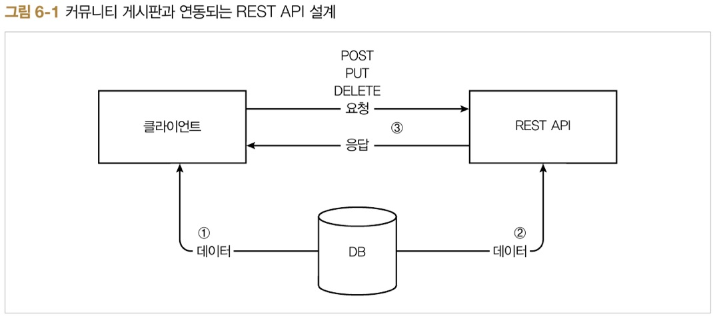
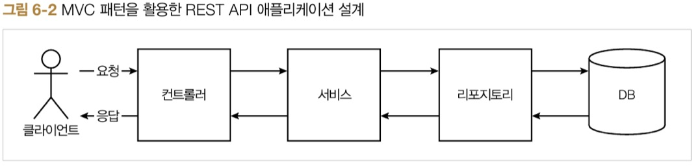
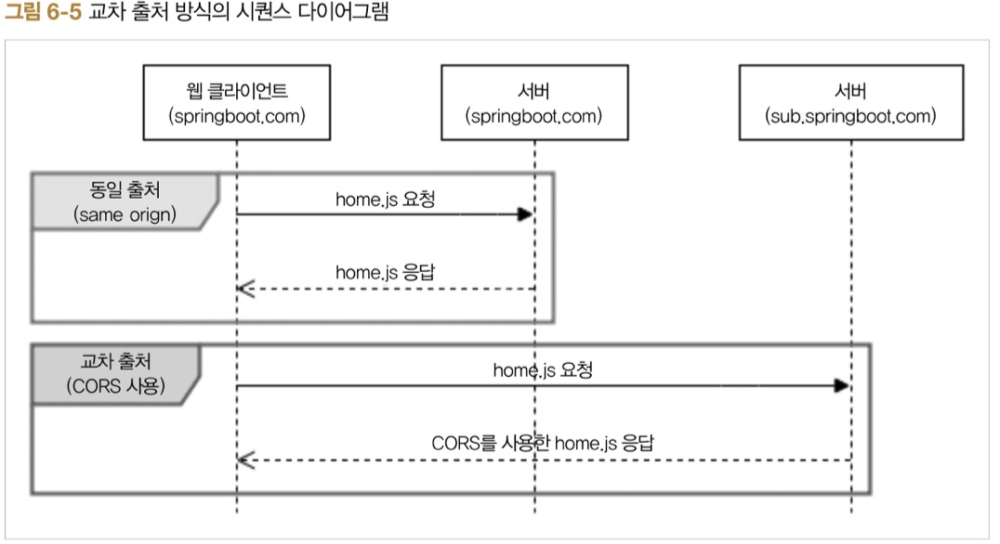

# ch6. 스프링 부트 데이터 레스트

REST는 웹의 장점을 극대화하는 통신 네트워크 아키텍처이며, REST의 구현 원칙을 제대로 지키는 시스템을 RESTfull이라고 함.

## 6.1 배경지식

### 6.1.1 REST 소개

REST는 웹과 같은 분산 하이퍼미디어 시스템에서 사용하는 통신 네트워크 아키텍처, 네트워크 아키텍처의 원리 모음이다.

> REST 목적
* 구성요소 상호작용의 규모 확장성
* 인터페이스의 범용성
* 구성요소의 독립적인 배포
* 중간적 구성요소를 이용한 응답 지연 감소, 보안 강화, 레거시 시스템 인캡슐레이션

### 6.1.2 RESTfull 제약 조건
> 구현 원칙
* client-server
* stateless
* casheable
* layered system
* code on demand 
* uniform interface

인터페이스 일관성  
1. 자원 식별
1. 메시지를 통한 리소스 조작
1. 자기 서술적 메시지
1. 애플리케이션 상태에 대한 엔진으로서의 하이퍼미디어(hypermedia as the engine of application state, HATEOAS)

### 6.1.3 REST API 설계하기

*URI 설계*   
명사를 사용해야 하며 동사를 피한다.

*복수형을 사용해라*
컬렉션으로 URI를 사용할 경우 컬렉션을 한번 더 감싼 중첩 형식으로 사용하는 것이 좋음.

*행위 설계*

## 6.2 설계하기


### 6.2.1 MVC 패턴을 활용하는 방법


### 6.2.2 스프링 부트 데이터 레스트를 활용하는 방법


## 6.3 스프링 부트 MVC 패턴으로 REST API 구현하기

### 6.3.1 준비하기

### 6.3.2 REST API 구현하기

> DataSouce 및 포트 설정

> Boardtype Enum 생성

> Board 클래스 생성

> SocialType Enum 생성

> User 클래스 생성

> BoardRepository 생성

> UserRepository 생성

> BoardRestController 생성

```
@RestContoller
@RequestMapping("/api/boards")
public class BoardRestController{
    
    private BoardRepository boardRepository;

    public BoardRestController(BoardRepository boardRepository){
        this.boardRepository = boardRepository;
    }

    @GetMapping(produces = MediaType.APPLICATION_JSON_VALUE)
    public ResponseEntity<?> getBoards(@PageableDefault Pageable pageable) {
        Page<Board> boards = boardRepository.findAll(pageable);
        PageMetadata pageMetadata = new PageMetadata(pageable.getPageSize(), boards.getNumber(), boards.getTotalElements()); // 페이징 처리에 관한 리소스를 만드는 PagedResources 객체를 생성하기 위해 PagedResouces 생성자의 파라미터로 사용되는 PageMetadata 객체를 생성. PageMetadata는 전체 페이지수, 현재 페이지수, 총 게시판 수로 구성
        PagedResouces<Board> resources = new PagedResouces<>(boards.getContent(), pageMetadata); //PagedResources 객체를 생성, 이 객체를 생성하면 HATEOAS가 적용되며 페이징값까지 생성된 REST형의 데이터를 만들어줌
        resources.add(linkTo(methodOn(BoardRestController.clas).getBoards(pagealbe)).withSelfRel()); //PagedResouces 객체 생성 시 따로 링크를 설정하지 않았다면 이와 같이 링크를 추가할 수 있다.
        return ReponseEntity.ok(resources);
    }
}
```

### 6.3.3 CORS 허용 및 시큐리티 설정

*CORS* cross origin resource sharing (교차 출처 자원 공유)  
서로 다른 도메인의 접근을 허용하는 권한을 부여



```
@SpringBootApplicadtion
public class RestWebApplicadtion{

    public static void main(Stirng[] args){
        SpringApplication.run(RestWebbApplicadtion.class, args);
    }

    @Configuraion
    @EnableGlobalMethodSecurity(prePostEnabled = true) //@PreAuthorize와 @PostAuthorize를 사용하기 위해 붙이는 어노테이션
    @EnableWebSecurity //웹용 시큐리티를 활성화하는 어노테이션
    static class SecurityConfiguration extends WebSecurityConfigurerAdapter {

        @Override
        protected void configure(HttpSecurity http) throws Exception {
            CorsConfiguration configuration = new CorsConfiguration();
            configuration.addAllowedOrigin(CorsConfiguration.ALL); //CorsConfiguration 객체를 생성하여 CORS에서 Origin, Method, Header 별로 허용할 값을 설정할 수 있다.
            configuration.addAllowdeMethod(CorsConfiguration.ALL);
            configuration.addAllowedHeader(CorsConfiguration.ALL);
            UrlBasedCorsConfigurationSource source = new UrlBasedCorsConfigurationSource();
            source.registerCorsConfiguration("/**", configuration); //CorsConfiguration 객체에서 설정한 값을 CorsConfigurationSource 인터체이스를 구현한 UrlBasedCorsConfigurationSource에 적용.

            http.httpBasic()
                .and().authrizeRequest()
                .anyRequest().permitAll()
                .and().cors().configurationSource(source) //스프링 시큐리티의 CORS 설정에서는 CorsConfigurationSource 인터페이스의 구현체를 파라미터로 받는 configurationSource가 있다.
                .and().csrs().disable();
        }
    }
}
```

### 6.3.4 생성, 수정, 삭제 구현

### 6.3.5 동작 확인

## 6.4 스프링 부트 데이터 레스트로 REST API 구현하기

