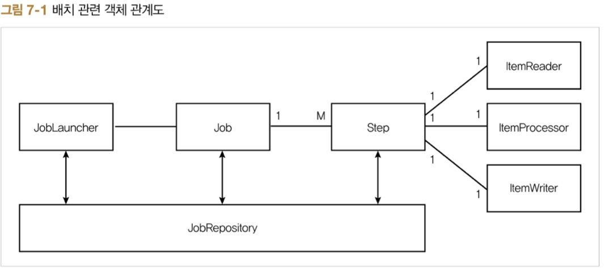

# ch7. 스프링 부트 배치

## 7.1 배경지식

### 7.1.1 배치 처리에 스프링 부트 배치를 써야 하는 이유

스프링 부트 배치의 장점
* 대용량 데이터 처리에 최적화되어 고성능을 발휘
* 효과적인 로깅, 통계 처리, 트랜잭션 관리 등 재사용 가능한 필수 기능을 지원
* 수동으로 처리하지 않도록 자동화되어있음.
* 예외사항과 비정상 동작에 대한 방어 기능이 있다.
* 스프링 부트 배치의 반복되는 작업 프로세스를 이해하면 비지니스 로직에 집중할 수 있다.

### 7.1.2 스프링 부트 배치 2.0

스프링 부트 배치 2.0 (스프링 배치 4.0) 특징
* 기본적으로 자바 8 이상에서 동작
* 스프링 프레임워크 5로 진화하면서 새롭게 재배열된 의존성 트리를 지원
* ItemReaders, ItemProcessors, ItemWriters에 대한 빌더를 제공

### 7.1.3 스프링 부트 배치 주의사항

1. 가능하면 단순화해서 복잡한 구조와 로직을 피해야 한다.
1. 데이터를 직접 사용하는 작업이 빈번하게 일어나므로 데이터 무결성을 유지하는 유효성 검사 등의 방어책이 있어야 한다.
1. 배치 처리 시스템 I/O 사용을 최소화해야 한다. 잦은 I/O로 데이터베이스 커넥션과 네트워크 비용이 커지면 성능에 영향을 줄 수 있기 때문. 따라서 가능하면 한번에 데이터를 조회하여 메모리에 저장해두고 처리한 다음, 그 결과를 한번에 데이터베이스에 저장하는 것이 좋다.
1. 배치 처리가 진행되는 동안 다른 프로젝트 요소에 영향을 주는 경우가 없는지 주의를 기울여야 한다.
1. 스프링 부트 배치는 스케쥴러를 제공하지 않습니다.

## 7.2 스프링 부트 배치 이해하기

배치의 일반적인 시나리오
1. read : 데이터 저장소에서 특정 데이터 레코드를 읽는다.
1. processing : 원하는 방식으로 데이터를 가공/처리 한다.
1. write : 수정된 데이터를 다시 저장소에 저장



`Job이라는 하나의 큰 일감(Job)에 여러 단계(Step)를 두고, 각 단계를 배치의 기본 흐름대로 구현`

### 7.2.1 Job

> Job은 배치 처리 과정을 하나의 단위로 만들어 표한한 객체

`JobBuilderFactory`
```
public class JobBuilderFactory{
    private JobRepository jobRepository;

    public JobBuilderFactory(JobRepository jobRepository){
        this.jobRepository = jobRepository;
    }

    public JobBuilder get(String name){
        JobBuilder builder = new JobBuilder(name).repository(jobRepository);
        return builder;
    }
}
```

*JobBuilderFacetory에 get() 메소드 호출할 때마다 새로운 빌더가 생성*

`JobBuilder`


```
public SimpleJobBuilder start(Step step) { 
    return new SimpleJobBuilder(this).start(step);
}
//Step을 추가해서 가장 기본이 되는 SimpleJobBuilder를 생성

public JobFlowBuilder start(Flwo flow){
    return new FlowJobBuilder(this).start(flow);
}
//Flow를 실행할 JobBuilder를 생성

public JobFlowBuilder flow(Step step){
    return new FlowJobBuilder(this).start(step);
}
//Step을 실행할 JobFlowBuilder를 생성
```

_SimpleJobBuilder를 활용한 Job 생성 예제 코드_
```
@Autowired
private JobBuilderFactory jobBuilderFactory;

@Bean
public Job simpleJob(){
    return jobBuilderFactory.get("simpleJob")
        .start(simpleStep())
        .build();
}
```
_JobInstance_
배치에서 Job이 실행될 떄 하나의 Job 실행 단위

_JobExecution_
JobInstance에 대한 한 번의 실행을 나타내는 객체

```
public class JobExecution extends Entity{
    private final JobParameters jobParameters;
    private JobInstance jobInstance;
    private volatile Collection<StepExecution> stepExecutions = Collections.synchronizedSet(new LinkedHashSet<>());
    private volatile BatchStatus status = BatchStatus.STARTING;
    private volatile Data startTime = null;
    private volatile Data createTime = new Data(System.currentTimeBillis());
    private volatile Data endTime = null;
    private volatile Data lastUpdated = null;
    private volatile ExitStatus exitStatus = ExitStatus.UNKNOWN;
    private volatile ExecutionContext executionContext = new ExecutionContext();
    private transient volatile List<Throwable> failureExceptions = new CopyOnWriteArrayList<>();
    private final Stirng jobConfigurationName;
    ...
}
```

_JobParameters_
Job이 실행될때 필요한 파라미터들을 Map 타입으로 저장하는 객체

### 7.2.2 Step

*StepExecution*
Step 실행 정보를 담는 객체
```
public class StepExecution extends Entity{
    private final JobExecution jobExecution;
    private final String stepName;
    private volatile BatchStatus = BatchStatus.STARTING;
    private volatile int readCount = 0;
    private volatile int writeCount = 0;
    private volatile int commitCount = 0;
    private volatile int rollbackCount = 0;
    private volatile int readSkipCount = 0;
    private volatile int processSkipCount = 0;
    private volatile int writeSkipCount = 0;
    private volatile ata startTime = new Data(System.currentTimeMillis());
    private volatile Data endTime = null;
    private volatile Data lastUpdated = null;
    private volatile ExecutionContext executionContext = new ExecutionContext();
    private volatile ExitStatus exitStatus = ExitStatus.EXECUGING;
    private volatile boolean terminateOnly;
    private volatile int filterCount;
    private transient volatile List<Throwable> failureExceptions = new CopyOnWriteArrayList<Throwable>();
    ... 
}
```

### 7.2.3 JobRepository
배치 처리 정보를 담고 있는 mechanism. 어떤 Job이 실행되었으며 몇 번 실행되었고 언제 끝났는지 등 배치 처리에 대한 메타데이터를 저장

### 7.2.4 JobLauncher
Job, JobParameters와 함께 배치를 실행하는 인터페이스

### 7.2.5 ItemReader
Step의 대상이 되는 배치 데이터를 읽어오는 인터페이스. FIlE, XML, DB 등 여러 타입의 데이터를 읽어올 수 있습니다.

### 7.2.6 ItemProcessor
ItemReader로 읽어온 배치 데이터를 변환하는 역할

### 7.2.7 ItemWriter
배치 데이터를 저장

## 7.3 스프링 부트 휴면회원 배치 설계하기


## 7.4 스프링 부트 배치 설정하기

> build.gradle

> UserStatus

> Grade

> User

## 7.5 스프링 부트 휴면회원 배치 구현하기

### 7.5.1 휴면회원 배치 테스트 코드 생성

> JobLauncherTestUtils
* 배치의 Job을 실행해 테스트하는 유틸리티 클래스
```
@EnableBatchProcessing //스프링 부트 배치 스타터에 미리 정의된 설정들을 실행시키는 어노테이션. JobBuilder, StepBuilder, JobRepository, JobLauncher
@cConfiguration
public class TestJobConfig{

    @Bean
    publi JobLauncherTestUtils jobLauncherTestUtils(){
        return new JobLauncherTestUtils(); 
        //Job 실행에 필요한 JobLauncher를 필드값으로 갖는 JobLauncherTestUtils를 빈으로 등록
    }
}
```

> InactiveUserJobTest.java

```
@RunWith(SpringRunner.class)
@SpringBootTest
public class InactiveUserJobTest{

    @Autowired
    private JobLauncherTestUtils jobLauncherTestUtils;

    @Autowired
    private UserRepository userRepository;

    @Test
    public void 휴면_회원_전환_테스트() throws Exception{
        JobExecution jobExecution = jobLauncherTestUtils.launchjob(); //Job을 실행, 반환값으로 실행 결과에 대한 정보를 담고 있는 JobExecution이 반환된다.

        assertEquals(BatchStatus.COMPLETED, jobExecution.getStatus()); //getStatus() 값이 COMPLETED로 출력되면 Job의 실행 여부 테스트는 성공이다.
        assertEquals(0, userRepository.findByUpdateDateBeforeAndStatusEquals(LocalDataTime.now().minusYears(1), UserStatus.ACTIVE).size()); //업데이트된 날짜가 1년 전이며 User 상태값이 ACTIVE인 사용자들이 없어야 휴면회원 배치 테스트가 성공.
    }
}
```

### 7.5.2 휴면회원 배치 정보 설정

> InactiveUserJobConfig
```
@AllArgsConstructor
@Configuration
public class InactiveuserJobConfig{

    private UserRepository userRepository;

    @Bean
    public Job inactiveUserJob(JobBuilderFactory jobBuilderFactory, Step inactiveJobStep) { //JobBuilderFactory를 주입. 빈에 주입할 객체를 파라미터로 명시하면 @Autowired 어노테이션을 쓰는 것과 같은 효과가 있음
    
    return jobBuilderFactory.get("inactiveUserJob")
        .preventRestart() //job의 재실행을 막는다.
        .start(inactiveJobStep) //inactiveJobStep을 제일 먼저 실행하도록 설정
    }

    @Bean
    public Step inactiveJobStep(StepBuilderFactory stepBuilderFactory) {
        return stepBuilderFactory.get("inactiveUserStep") // 'inactiveUserStep'이라는 이름의 StepBuilder를 생성
            .<User, User> chunk(10) //제네릭을 사용해 chunk()의 입력 타입과 출력 타입을 User 타입으로 설정. chunk의 인잣값은 10으로 설정했는데 쓰기 시에 청크 단위로 묶어서 writer() 메서드를 실행시킬 단위를 지정. 즉, 커밋의 단위가 10개
            .reader(inactiveUserReader())
            .processor(inactiveUserProcessor())
            .writer(inactiveuserWriter()) //Step의 reader, processor, writer를 각각 설정
            .build();
    }

    @Bean
    @StepScope //기본 빈 생성은 싱글턴이지만 @StepScope를 사용하면 해당 메서드 Step의 주기에 따라 새로운 빈을 생성. 즉, 각 Step의 실행마다 새로 빈을 만들기 때문에 지연 생성이 가능. 주의할 사항은 @StepScope는 기본 프록시모드가 반환되는 클래스 타입을 참조하기 때문에 @StepScope를 사용하면 반드시 구현된 반환 타입을 명시해 반환해야 한다.
    public QueueItemReader<User> inactiveUserReader() {
        List<User> oldUsers = userRepository.findByUpdatedDateBeforeAndStatusEquals(LocalDateTime.now().minusYears(1), UserStatus.ACTIVE);
        return new QueueItemReader<>(oldUsers);
    }

    public ItemProcessor<User, User> inactiveUserProcessor() {
        //return User::setInactive;
        return new ItemProcessor<User, User>() {

            @Override
            pubblic User processor(User user) throws Exception {
                return user.setInactive();
            }
        }
    }

    public ItemWriter<User> inactiveUserWriter() {
        return ((List<? extends User> users) -> userRepository.saveAll(users));
    }
}
```
> BatchApplication
```
@SrpingBootApplication
@EnableBatchProcessing
publi class BatchApplication {

    public static void main(String[] args) {
        SprpingApplication.run(BatchApplication.class, arsgs);
    }
}
```

### 7.5.3 SQL로 테스트 데이터 주입하기

## 7.6 스프링 배치 심화학습

### 7.6.1 다양한 ItemReader 구현 클래스

### 7.6.2 다양한 ItemWriter 구현 클래스

### 7.6.3 JobParameter 사용하기

### 7.6.4 테스트 시에만 H2 데이터베이스를 사용하도록 설정하기

@AutoConfigureTestDatabase

### 7.6.5 청크 지향 프로세싱

### 7.6.6 배치의 인터셉터 Listener 설정하기

### 7.6.7 어노테이션 기반으로 Listener 설정하기

### 7.6.8 Step의 흐름을 제어하는 Flow

## 7.7 멀티 스레드로 여러 개의 Step 실행하기

### 7.7.1 TaskExecutor를 사용해 여러 Step 동작시키기

### 7.7.2 여러 개의 Flow 실행시키기

### 7.7.3 파티셔닝을 사용한 병렬 프로그래밍


